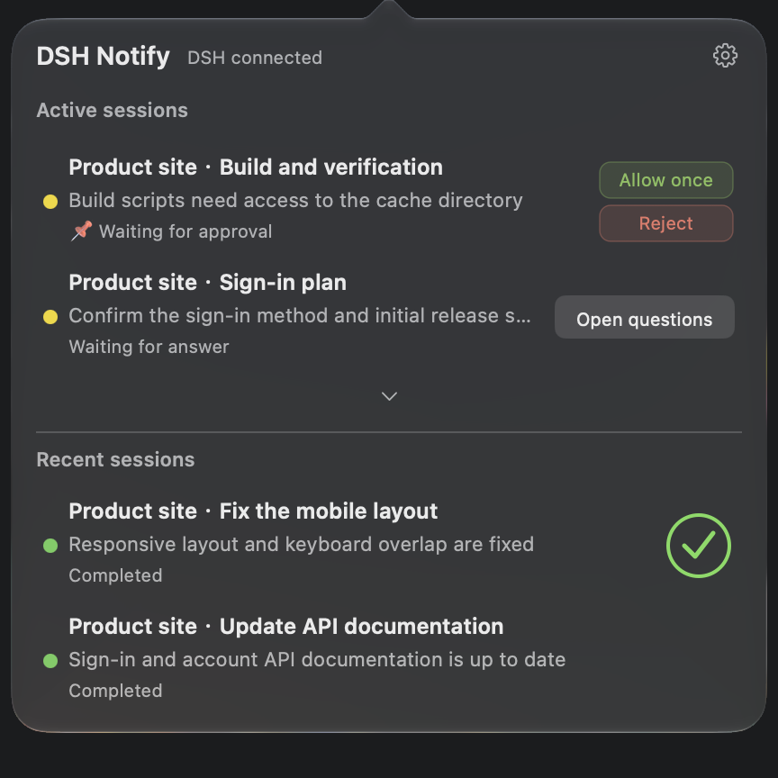
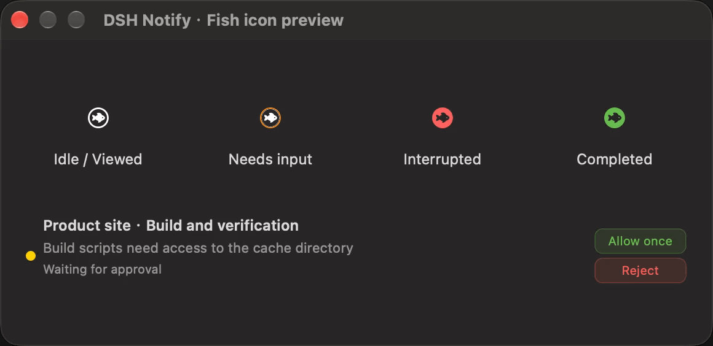
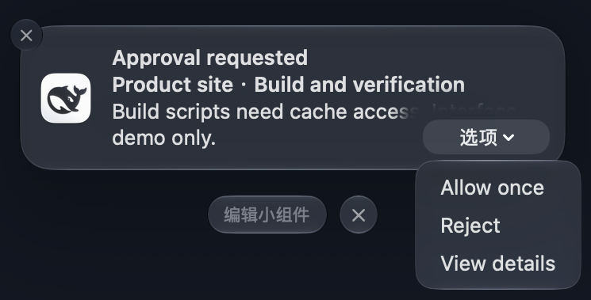
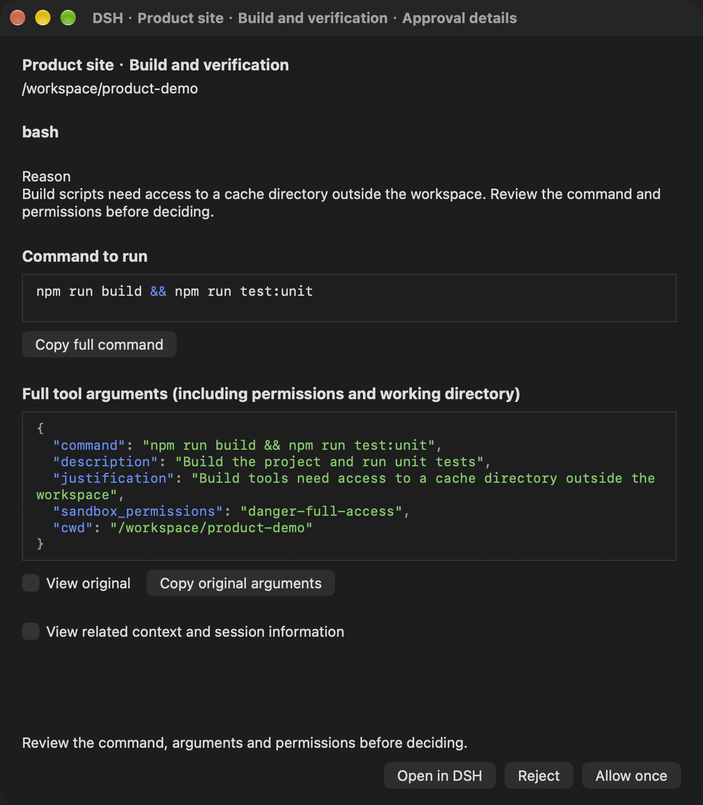
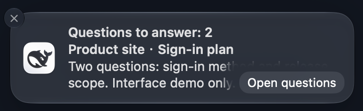
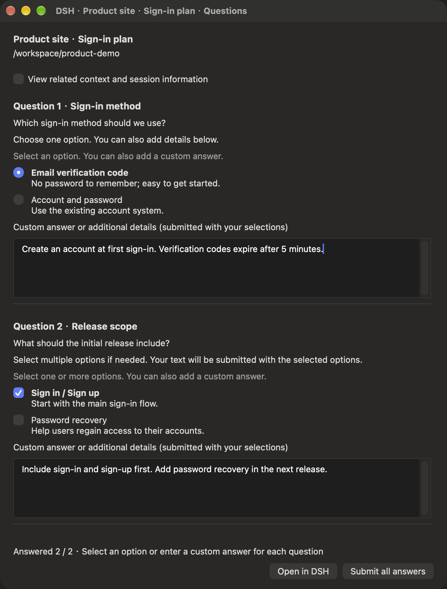

# DSH Notify

[简体中文](README.md) · **English**

Native macOS notifications, approvals, question forms and a session menu bar for **DeepSeek Harness Desktop**. Handle a request from a notification or return to its workspace and session in Desktop.

The project combines a DSH plugin with the background **DSH Notify.app** helper. The helper starts and stops with Desktop. No browser, DSH Bridge or additional model service is required.

This is a community plugin. The current stable version is **v0.5.0**. See [Releases](https://github.com/realDGD/dsh-macos-notify/releases/tag/v0.5.0) for versions and downloads.

## Features

| Feature | What it does |
| --- | --- |
| Native notifications | Reports completion, errors, approvals and questions; clicking returns to the corresponding DSH session. |
| Quick approvals | Choose **Allow once** or **Reject** from a notification or the menu bar, or open approval details to review the command. |
| Complete question forms | One reminder opens all questions. Each keeps its choices and a separate text field, with single-select, multi-select and one batch submission. |
| Session panel | Shows activity, nested subagents and five recent top-level sessions, with status labels and task progress. |
| Context and code | Renders Markdown tables, formulas and code; Shell/JSON highlighting and soft-wrapped commands and arguments improve readability. |
| DSH language support | Follows DSH's English or Chinese setting. Session names, questions, choices, answers and commands stay in their original language. |

DSH decides whether a request is still valid. The first accepted response wins; answered, canceled or expired requests are withdrawn, and stale buttons cannot repeat an action. Closing a question window or briefly disconnecting keeps each question’s draft. **Clear answers** resets all choices and text without canceling the request. Drafts stay in helper memory and are cleared when DSH confirms that the request was answered, canceled or withdrawn; quitting the helper discards unsent drafts. An unconfirmed result is never retried automatically.

## Interface preview

These are real native screenshots and recordings of the English interface, using fictional workspaces, sessions and requests. macOS Notification Center controls follow the system language. Click an image to view it at full size.

### Session menu and quick actions

Activity and recent sessions have separate sections. Handle an approval in place or open a question form. Disclosure arrows show more sessions and nested subagents.

<table>
<tr><th>Session menu and quick actions</th><th>Fish icon states and animation</th></tr>
<tr>
<td valign="top"><a href="docs/images/menu-sessions-en.png"></a></td>
<td valign="top"><a href="docs/images/menu-icon-states-en.gif"></a></td>
</tr>
</table>

The fish rotates while tasks are running. Orange indicates approvals or questions, red indicates abnormal interruption, and green indicates completion. Alert priority is **needs input > abnormal stop > completion**. Opening the panel restores the white icon; a user-initiated stop does not create an error alert.

### Approval notifications and details

Notifications offer approval, rejection and **View details**. Choosing **View details** opens the **Approval details window** shown on the right, with the reason, command, full arguments and related context.

<table>
<tr><th>Approval notification and actions</th><th>Approval details: review commands and permissions</th></tr>
<tr>
<td valign="top"><a href="docs/images/notification-approval-en.png"></a></td>
<td valign="top"><a href="docs/images/approval-details-en.png"></a></td>
</tr>
</table>

Arguments are indented, and commands and arguments wrap automatically. **View original** and **Copy original arguments** preserve the original content. Display formatting never changes the request sent to DSH.

### Question notifications and forms

Choosing **Open questions** opens the **question form** shown on the right. Each question has its own choices and text field; submit the full set of answers once.

<table>
<tr><th>Question notification</th><th>Question form: choices and a text field for each question</th></tr>
<tr>
<td valign="top"><a href="docs/images/notification-questionnaire-en.png"></a></td>
<td valign="top"><a href="docs/images/questionnaire-en.png"></a></td>
</tr>
</table>

If you answer in DSH first, the old notification request becomes invalid. After **Open in DSH** successfully selects the session, the question window closes automatically.

See [image sources and scope](docs/images/README.md). Demo requests do not execute commands, call a model or submit real answers.

<a id="installation"></a>

## Installation

**The easiest option is to install from DeepSeek Harness Desktop.** Prepare the build tools, then paste one plugin address. The installer compiles and installs **DSH Notify.app** on your Mac.

> **v0.5.0** supports automatic helper installation. The older `v0.5.0-preview.1` still needs the manual steps below.

You need **macOS 13 or later** and official **DSH Desktop**. The tested DSH version is `0.2.0-rc.2`. Desktop installation uses its bundled Node.js/pnpm; a separate Node.js 22+ installation is needed only for manual builds or development. See [compatibility](docs/compatibility.md) for older macOS and Intel verification limits.

### Recommended: install from DSH Desktop

1. **Prepare the build tools.** Run the command below in macOS Terminal and finish the Apple Command Line Tools installation. If they are already installed, continue. Full Xcode and a paid certificate are not required.

   ```sh
   xcode-select --install
   ```

2. **Add the plugin.** In DSH Desktop, open **Plugins → Add plugin** in the sidebar. Paste this address, confirm that you trust the source, and select **Install**:

   ```text
   github:realDGD/dsh-macos-notify
   ```

3. **Approve the build.** If build scripts are blocked, review this plugin and select **Allow these scripts and retry**. Wait for installation to finish. The helper is installed at `~/Applications/DSH Notify.app`. A matching helper is reused; upgrades retain settings and back up the previous App.
4. **Enable and restart.** Select **Enable now** for DSH Notify. Save your ongoing work, quit Desktop with **⌘Q**, then reopen it; closing a window does not quit the app. Desktop starts the helper automatically. Allow notifications for **DSH Notify** when macOS asks.
5. **Check that it works.** Open **Settings → DSH Notify**, check the helper connection and notification permission, then send the safe test notification and click it. Confirm that the matching session opens. Accepted by macOS means delivery was accepted; an actual successful click verifies navigation.

The [official DSH plugin guide](https://github.com/deepseek-ai/deepseek-harness/blob/master/packages/client/ui-plugin-manager/README.md) covers installation, build approval and enabling plugins. Local compilation still requires build-script approval and macOS notification permission.

<details>
<summary>Alternative: use a terminal command</summary>

In Desktop's application menu, use **Manage dsh Command…** to install the command. Open a new terminal and run:

```sh
dsh plugin --profile desktop add github:realDGD/dsh-macos-notify
```

Return to Desktop's plugin list and make sure DSH Notify is enabled, then follow steps 4 and 5 above. If the terminal reports blocked scripts, use the plugin manager to approve them. For manual configuration of the exact package-version key, see the [detailed installation guide](docs/install.md).

Desktop uses the `desktop` profile; `--profile web` installs into a separate Web environment. Use the command supplied by Desktop; no separate npm CLI is needed. See the [official terminal-command guide](https://github.com/deepseek-ai/deepseek-harness/blob/master/apps/desktop/README.md#terminal-command).

</details>

### Need help? Ask DeepSeek Harness to install it

Copy this request into a new DSH conversation. It gives the agent a concrete installation task and asks it to guide you through any system dialogs, build approval or restart steps.

```text
Help me install DSH Notify in official DeepSeek Harness Desktop on this Mac:
https://github.com/realDGD/dsh-macos-notify

Read the repository README and docs/install.md first. Check the DSH version, macOS 13+ requirement and Apple Command Line Tools.
Use Desktop's desktop profile. Prefer the plugin manager or the dsh CLI supplied by Desktop.
Check whether ~/Applications/DSH Notify.app has been built and installed. If the public version does not support automatic builds, install the helper from the same revision using its source instructions.
Keep existing settings and previous-helper backups. Tell me exactly what to do when a system installation, build approval or notification permission needs my action.
After installation, have me save ongoing work, quit and reopen Desktop, then guide me through sending and clicking the safe test notification to verify the matching session.
```

<details>
<summary>Manual installation: older previews, a failed automatic install or development</summary>

Finish the Command Line Tools installation above and install [Node.js 22+](https://nodejs.org/en/download). Run these commands in Terminal:

```sh
git clone https://github.com/realDGD/dsh-macos-notify.git
cd dsh-macos-notify
npm ci --ignore-scripts
bash macos/install.sh
pwd
```

`pwd` prints the source directory's absolute path. Paste it into Desktop's **Plugins → Add plugin**, install and enable the plugin, then follow steps 4 and 5 of the recommended flow. You can also download a **complete source archive** from [Releases](https://github.com/realDGD/dsh-macos-notify/releases), extract it, open its source directory in Terminal and run the commands above starting with `npm ci --ignore-scripts`.

Keep the plugin and helper on the same revision. By default, the build copies the official icon from `/Applications/DeepSeek Harness.app`. If Desktop is installed elsewhere, specify its path as explained in the [installation guide](docs/install.md).

</details>

### Common installation problems

| Problem | What to do |
| --- | --- |
| `swiftc` is missing or build tools are unavailable | Finish the system installation started by `xcode-select --install`, then retry in DSH. |
| Build scripts are blocked | Select **Allow these scripts and retry** in DSH's installation dialog. |
| The `dsh` command is not found | Use the recommended plugin-manager flow, or install/repair the command from Desktop's application menu and open a new terminal. |
| DSH reports an incompatible version | Choose matching DSH and plugin versions using the [compatibility guide](docs/compatibility.md). |
| The helper is missing or an upgrade is refused | Use manual installation for the older preview. For upgrades, handle drafts and close native question/approval panels before retrying. |
| GitHub cannot be reached | Check the GitHub connection and retry, or use a complete source archive you already downloaded. Changing the npm registry does not download the GitHub repository. |
| No notification appears after installation | Check **System Settings → Notifications → DSH Notify** and Focus settings, then send a test from the plugin settings. |

The helper starts and stops with Desktop; it is not a login item. See the [installation guide](docs/install.md) for detailed build, recovery and uninstall instructions.

## Everyday use

- **Menu bar:** Click the fish icon. Activity prioritizes pinned sessions, requests needing input and abnormal stops, followed by running sessions. The recent section shows up to five top-level sessions, excluding sessions already in activity and all subagents.
- **Expansion and progress:** Each section shows an expansion arrow only when needed, without wheel scrolling or scrollbars. Task counts appear inside the progress ring; a completed plan becomes a green check. Sessions without a plan have no ring.
- **Quick actions:** Approvals have vertically arranged Allow/Reject buttons; questions open the complete form. An **Actions** menu separates multiple requests in the same session.
- **Notification settings:** Configure notification types, system sound, separate subagent results, waiting for subagents before reporting completion, and silencing reminders while viewing the session.
- **Menu bar toggle:** Disable it from DSH Notify settings or the panel's gear. Notifications and native approval/question windows remain available. Re-enable it in DSH Settings.
- **Language:** Change DSH's language setting. Open windows update their UI wording while retaining choices and drafts. Delivered notifications keep the language used when sent.

Related context is rendered locally with Markdown and KaTeX, including headings, lists, quotes, tables, formulas and code. Remote images are not loaded automatically, and raw HTML is inert. Very long context states its truncation limit; open DSH to read the full text.

## Upgrade and uninstall

Before upgrading, save ongoing work, handle any unsubmitted drafts, then close native question/approval windows. In the current DSH plugin manager, **remove the plugin and add it again** to install a newer version. A version with automatic installation also checks and updates the helper. For a manual source install, run `npm ci --ignore-scripts` and `bash macos/install.sh`, then add the matching source directory again. Restart Desktop normally afterward.

The installer retains settings, backs up the previous helper and confirms its process has exited before replacing it. Users migrating from `dsh-notify-web` / `DSH Jump.app` should remove the old notification plugin and completion/error relay to avoid duplicate reminders. The historical helper identity is retained for notification permission and compatibility.

To uninstall, remove the plugin in DSH's plugin manager, then run from the source directory:

```sh
bash macos/uninstall.sh
```

Restart Desktop afterward. Settings and application backups are kept; only files managed by this installer are removed.

## Privacy and limits

- No additional network listener, cloud service or model session is created. Navigation and settings use DSH's authenticated connection; the plugin and helper exchange data through private files owned by the current user.
- Questions and approvals are temporarily stored locally to display their forms and are not exported with diagnostics. Do not upload local state, tokens, session content or unredacted screenshots in issue reports.
- macOS controls notification display, Focus modes and lock-screen previews. Quiet mode only affects reminders; it never approves, rejects or answers automatically.
- One active local Host/state directory is supported. Multiple Hosts sharing one directory, older macOS and Intel have not been verified on real devices.
- Local live acceptance covers menu expansion/collapse, navigation to the correct recent session, drafts surviving question-window close/reopen, Clear answers, and removal of the question action after answering or canceling in DSH.

## Development and verification

```sh
npm ci --ignore-scripts
npm test
npm run test:native       # macOS: real AppKit/WebKit components
npm run check:release
```

The complete source archive contains tests, lockfiles, CI and build scripts. The plugin `.tgz` includes runtime and helper sources but not the full test suite. See the [release procedure](docs/release.md) for maintainer packaging and archive verification, and [CHANGELOG](CHANGELOG.md) for changes.

## License

[MIT](LICENSE). The DSH name and locally sourced official icon identify the integration; this repository grants no rights to third-party branding. Offline rendering resources and their licenses are listed in [THIRD_PARTY](THIRD_PARTY.md).
