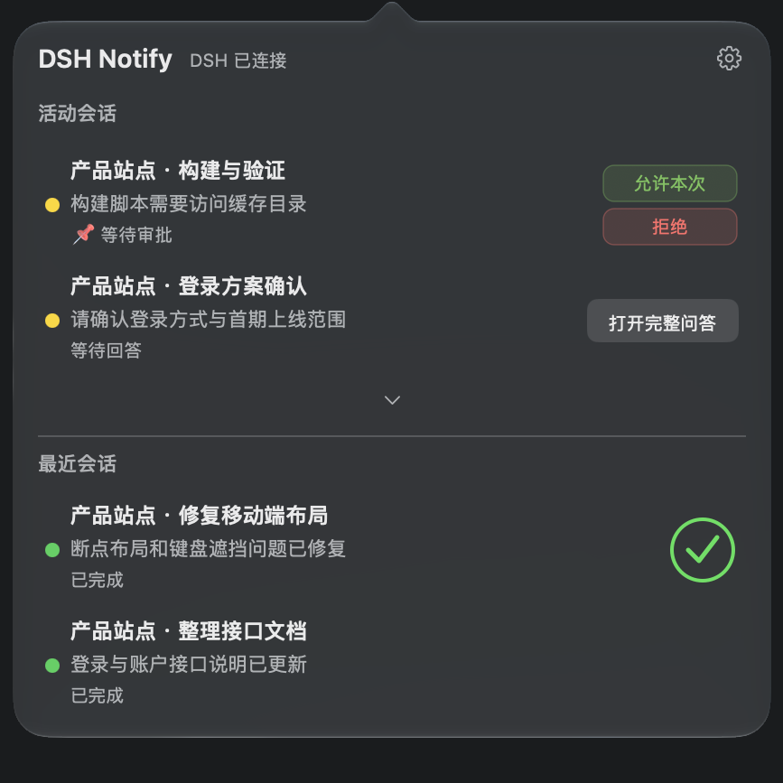
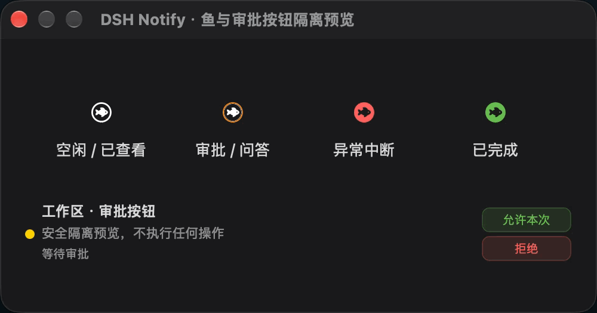
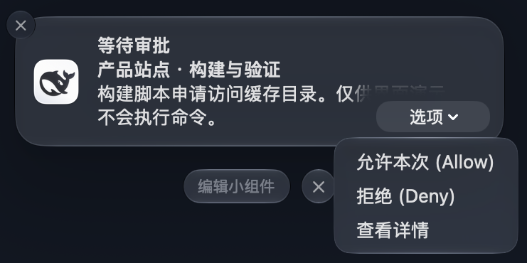
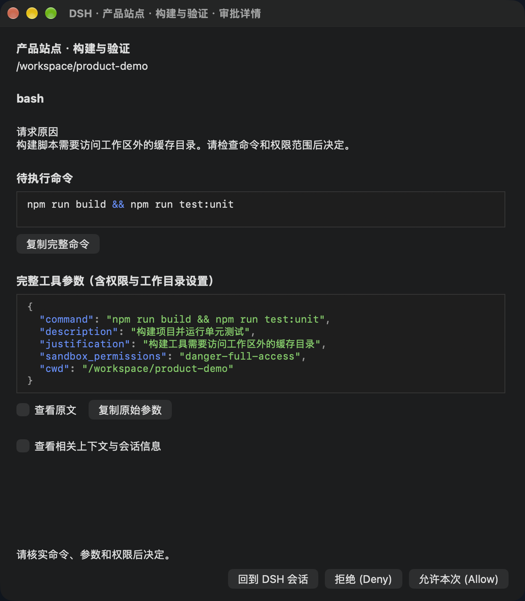
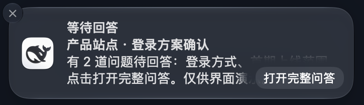
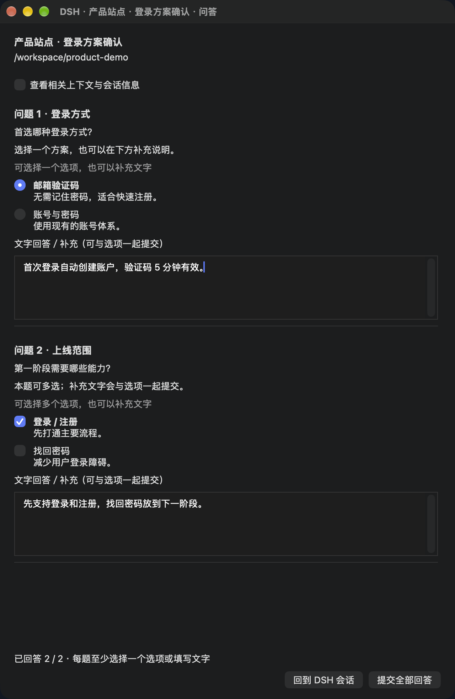

# DSH Notify

**简体中文** · [English](README.en.md)

为 **DeepSeek Harness Desktop** 提供原生 macOS 通知、审批、完整问答和菜单栏会话面板。收到通知后，可以直接处理请求或返回对应工作区与会话。

项目由 DSH 插件和后台助手 **DSH Notify.app** 组成。助手跟随 Desktop 启停，无须浏览器、DSH Bridge 或额外模型服务。

这是社区插件。当前稳定版本为 **v0.5.0**；版本和下载见 [Releases](https://github.com/realDGD/dsh-macos-notify/releases/tag/v0.5.0)。

## 能做什么

| 功能 | 使用方式 |
| --- | --- |
| 原生通知 | 接收任务完成、报错、审批和问答提醒，点击返回对应 DSH 会话。 |
| 快捷审批 | 从系统通知或菜单栏选择「允许一次」或「拒绝」；需要核对命令时打开审批详情。 |
| 完整问答 | 一条提醒打开整组问题，每题保留选项和独立文字输入，支持单选、多选与整批提交。 |
| 会话面板 | 查看活动会话、嵌套子智能体和最近 5 条主会话，显示状态与任务进度。 |
| 上下文与代码 | 查看 Markdown 表格、公式与代码；Shell/JSON 高亮，命令和参数自动换行。 |
| 跟随 DSH 语言 | 界面跟随 DSH 的中文或英文设置；会话名、题干、选项、回答和命令保留原文。 |

DSH 决定请求是否有效。先被接受的回答生效；已回答、取消或过期的请求会撤回，旧按钮不会重复执行。关闭问答窗口或短暂断连会保留每题草稿；「清空回答」只清除选项和文字，不取消请求。草稿仅存于助手内存，DSH 确认已回答、取消或请求失效后清除；退出助手会丢弃未提交草稿。结果未确认时不会自动重试。

## 界面预览

截图和录屏使用虚构的工作区、会话与请求，均来自真实原生界面。它们取自较早的中文演示构建，按钮文案以当前版本和语言为准；点击图片可查看原图。

### 菜单栏与快捷操作

活动与最近会话分区展示。等待审批时直接允许或拒绝，等待回答时打开完整问答；展开箭头查看更多会话与嵌套子智能体。

<table>
<tr><th>菜单栏与快捷操作</th><th>鱼图标状态与旋转动画</th></tr>
<tr>
<td valign="top"><a href="docs/images/menu-sessions.png"></a></td>
<td valign="top"><a href="docs/images/menu-icon-states.gif"></a></td>
</tr>
</table>

有任务运行时，鱼图标旋转。待审批或问答用橙色，异常中断用红色，完成用绿色；提醒优先级为 **待处理 > 异常 > 完成**。打开面板后恢复白色图标，用户主动停止不会产生异常提醒。

### 审批通知与审批详情

通知提供允许、拒绝和 **「查看详情」**。点击「查看详情」，会直接打开右侧的 **审批详情窗口**，显示请求原因、待执行命令、完整参数和相关上下文。

<table>
<tr><th>审批通知与操作按钮</th><th>审批详情：先查看命令和权限</th></tr>
<tr>
<td valign="top"><a href="docs/images/notification-approval.png"></a></td>
<td valign="top"><a href="docs/images/approval-details.png"></a></td>
</tr>
</table>

参数按行排版，命令与参数自动换行。「查看原文」和「复制原始参数」保留原始内容；显示格式不会改动真正提交给 DSH 的请求。

### 问答通知与完整问答

点击通知中的 **「打开完整问答」**，会直接打开右侧的 **完整问答窗口**。每题都有自己的选项和文字输入，最后一次提交整组回答。

<table>
<tr><th>问答通知与打开按钮</th><th>完整问答：每题选项加独立输入</th></tr>
<tr>
<td valign="top"><a href="docs/images/notification-questionnaire.png"></a></td>
<td valign="top"><a href="docs/images/questionnaire.png"></a></td>
</tr>
</table>

在 DSH 中先回答后，通知中的旧请求会失效。点击「回到 DSH 会话」并确认跳转成功后，问答窗口自动关闭。

图片来源和演示范围见 [图片说明](docs/images/README.md)。演示不会执行命令、调用模型或提交真实回答。

<a id="installation"></a>

## 安装

**推荐直接在 DeepSeek Harness Desktop 中安装。** 准备好构建工具后，复制一个插件地址即可；安装器会在本机编译并安装 **DSH Notify.app**。

> **v0.5.0** 支持自动安装助手。旧版 `v0.5.0-preview.1` 仍需使用下方的「手动安装」。

需要 **macOS 13 或更新版本**和官方 **DSH Desktop**，当前验证版本为 `0.2.0-rc.2`。通过 Desktop 安装会使用其内置 Node.js/pnpm；只有手动构建或开发才需要另行准备 Node.js 22+。旧系统与 Intel 的实机验证范围见 [兼容性说明](docs/compatibility.md)。

### 推荐：通过 DSH Desktop 安装

1. **准备构建工具。** 在 macOS「终端」执行下面的命令，按系统提示完成 Apple Command Line Tools 安装；已安装时可直接继续。无须完整 Xcode 或付费证书。

   ```sh
   xcode-select --install
   ```

2. **添加插件。** 打开 DSH Desktop，进入侧边栏 **插件 → 添加插件**，粘贴以下地址，确认安装来源并点击安装：

   ```text
   github:realDGD/dsh-macos-notify
   ```

3. **允许构建。** 如果提示构建脚本被阻止，核对此插件后点击 **「允许这些脚本并重试」**，等待安装完成。助手会安装到 `~/Applications/DSH Notify.app`；已有匹配助手会复用，升级会保留设置并备份旧版。
4. **启用并重启。** 安装成功后启用 **DSH Notify**（英文按钮为 **Enable now**）。保存当前任务，按 **⌘Q** 退出 DSH Desktop，再重新打开；只关闭窗口不会退出应用。助手会随 Desktop 自动启动。macOS 询问时允许 **DSH Notify** 的通知。
5. **确认可用。** 打开 **设置 → DSH Notify**，检查助手连接和通知权限，发送安全测试通知并点击，确认打开对应会话。出现「系统已接受」只说明通知已投递，实际点击成功才证明跳转可用。

[DSH 官方插件安装说明](https://github.com/deepseek-ai/deepseek-harness/blob/master/packages/client/ui-plugin-manager/README.md)介绍了安装、构建授权和启用操作。本地编译仍需构建脚本授权和 macOS 通知权限。

<details>
<summary>也可以使用终端命令</summary>

先在 Desktop 的应用菜单中找到 **管理 dsh 命令 / Manage dsh Command…** 并安装命令，再打开一个新的终端执行：

```sh
dsh plugin --profile desktop add github:realDGD/dsh-macos-notify
```

安装后回到 Desktop 的插件列表确认已启用，再按上面的第 4、5 步重启和验证。若终端提示构建脚本被阻止，可改用插件管理器完成授权；需要手动配置时，按 [详细安装说明](docs/install.md) 处理当前插件的精确版本键。

Desktop 使用 `desktop` profile；`--profile web` 会安装到单独的 Web 环境。使用 Desktop 提供的 `dsh` 命令，无须另外安装 npm 版 CLI。详见 [DSH 官方终端命令说明](https://github.com/deepseek-ai/deepseek-harness/blob/master/apps/desktop/README.md#terminal-command)。

</details>

### 安装遇到困难？让 DeepSeek Harness 帮忙

把下面的请求复制到 DSH 的新会话中。它会有明确的检查和安装目标；系统对话框、构建授权或重启需要你操作时，让它给出具体步骤。

```text
请帮我在这台 Mac 的官方 DeepSeek Harness Desktop 中安装 DSH Notify：
https://github.com/realDGD/dsh-macos-notify

先阅读仓库 README 和 docs/install.md，核对 DSH 版本、macOS 13+ 要求和 Apple Command Line Tools。
使用 Desktop 的 desktop profile，优先通过插件管理器或 Desktop 自带的 dsh CLI 安装。
检查 ~/Applications/DSH Notify.app 是否已编译安装；如果当前公开版本不支持自动构建，按同一版本的源码文档补装助手。
保留已有设置和旧助手备份。需要我完成系统安装、构建授权或通知权限时，请告诉我具体操作。
安装完成后，让我先保存当前任务，再退出并重新打开 Desktop，最后指导我发送安全测试通知并点击验证对应会话。
```

<details>
<summary>手动安装（旧预览版本、自动安装失败或开发使用）</summary>

先完成上面的 Command Line Tools 安装，并准备 [Node.js 22+](https://nodejs.org/en/download)。打开终端，依次执行：

```sh
git clone https://github.com/realDGD/dsh-macos-notify.git
cd dsh-macos-notify
npm ci --ignore-scripts
bash macos/install.sh
pwd
```

最后的 `pwd` 会输出源码目录的绝对路径。把该路径填入 Desktop 的 **插件 → 添加插件**，安装并启用，然后按推荐流程的第 4、5 步重启和验证。也可下载 [Releases](https://github.com/realDGD/dsh-macos-notify/releases) 的**完整源码包**，解压后进入源码目录，从 `npm ci --ignore-scripts` 开始执行上面的命令。

插件与助手应来自同一版本。默认从 `/Applications/DeepSeek Harness.app` 复制本机官方图标；Desktop 位于其他路径时，按 [详细安装说明](docs/install.md) 指定路径。

</details>

### 常见安装问题

| 遇到的问题 | 下一步 |
| --- | --- |
| 找不到 `swiftc` 或提示缺少构建工具 | 完成 `xcode-select --install` 的系统安装，再回到 DSH 点击重试。 |
| 构建脚本被阻止 | 在 DSH 安装对话框点击「允许这些脚本并重试」。 |
| 找不到 `dsh` 命令 | 使用推荐的插件管理器安装，或在 Desktop 应用菜单安装/修复 dsh 命令后打开新终端。 |
| 提示版本不兼容 | 按 [兼容性说明](docs/compatibility.md) 选择匹配的 DSH 和插件版本。 |
| 助手未安装或升级被拒绝 | 旧预览版按手动步骤补装；升级时先处理草稿并关闭原生问答/审批窗口，再重试。 |
| 无法访问 GitHub | 检查 GitHub 连接后重试，或使用已下载的完整源码包；更换 npm 镜像不能替代 GitHub 仓库下载。 |
| 安装后没有通知 | 检查 macOS **系统设置 → 通知 → DSH Notify** 的权限与专注模式，再从插件设置发送测试通知。 |

助手跟随 Desktop 启停，不设置开机自启。更详细的构建、恢复和卸载步骤见 [安装说明](docs/install.md)。

## 日常使用

- **菜单栏**：点击鱼图标打开面板。活动区优先显示置顶、待处理或异常会话，其次是进行中的会话；最近区最多显示 5 条主会话，排除活动区已展示的会话与子智能体。
- **展开与进度**：两区按需显示展开箭头，没有滚轮翻动或滚动条。任务分数显示在进度环内，全部完成后变为绿色勾号；没有计划的会话不显示进度环。
- **快捷操作**：审批提供竖排允许/拒绝按钮，问答打开完整表单。同一会话有多项请求时，通过「处理请求」菜单分别操作。
- **通知设置**：可分别开关提醒类型、系统提示音、子智能体结果、等待子智能体后汇总完成，以及查看当前会话时的静默提醒。
- **菜单栏开关**：在 DSH Notify 设置或面板齿轮中关闭；通知和原生问答/审批窗口继续可用。重新启用请进入 DSH 设置。
- **语言切换**：修改 DSH 的语言设置即可。已打开窗口会更新界面文案并保留选项与草稿；已投递通知保留发送时的语言。

相关上下文使用本地 Markdown/KaTeX 渲染，支持标题、列表、引用、表格、公式和代码。远程图片不自动加载，原始 HTML 不执行；超长上下文会注明截取范围，可返回 DSH 阅读全文。

## 升级与卸载

升级前先保存当前任务、处理未提交草稿，再关闭原生问答/审批窗口。当前 DSH 插件管理器通过**移除插件后重新添加**安装新版；添加包含自动安装脚本的版本时，会同步检查和更新助手。手动源码安装仍运行 `npm ci --ignore-scripts` 和 `bash macos/install.sh`，再重新添加对应源码目录。最后正常重启 Desktop。

安装器保留设置，备份旧助手，并确认旧进程退出后再替换应用。旧 `dsh-notify-web` / `DSH Jump.app` 用户应移除旧通知插件和旧完成/报错 relay，避免重复提醒；历史助手身份保留以延续通知权限和兼容性。

卸载时先在 DSH 插件管理器中移除本插件，再从源码目录运行：

```sh
bash macos/uninstall.sh
```

然后重启 Desktop。卸载保留设置与应用备份，只移除本安装器管理的文件。

## 隐私与边界

- 不增加网络监听、云服务或模型会话。会话选择与设置使用 DSH 已认证的连接；原生助手与插件通过当前用户的私有本地文件交换数据。
- 问答和审批内容需要本地暂存以显示表单，不会随诊断导出。报告问题时请勿上传本地状态、令牌、会话正文或未脱敏截图。
- macOS 控制通知显示、专注模式和锁屏预览；静默只影响提醒，不会自动批准、拒绝或回答。
- 当前支持一个本地活动 Host/状态目录，多个 Host 共用同一目录尚未验证。旧系统与 Intel 的实机支持尚未验收。
- 本机真实验收包括菜单展开/收起、最近会话正确跳转、问答关闭重开保留草稿、清空回答，以及 DSH 内回答或取消后撤回问答入口。

## 开发与验证

```sh
npm ci --ignore-scripts
npm test
npm run test:native       # macOS：真实 AppKit/WebKit 组件
npm run check:release
```

完整源码包包含测试、锁文件、CI 和构建脚本；插件 `.tgz` 包含运行时与助手源码，但不包含完整测试套件。维护者发布流程与归档校验见 [发布文档](docs/release.md)，变更见 [CHANGELOG](CHANGELOG.md)。

## 许可证

[MIT](LICENSE)。DSH 名称与本地取得的官方图标用于说明集成对象，第三方品牌权利不由本仓库授权。离线渲染资源及许可证见 [THIRD_PARTY](THIRD_PARTY.md)。
